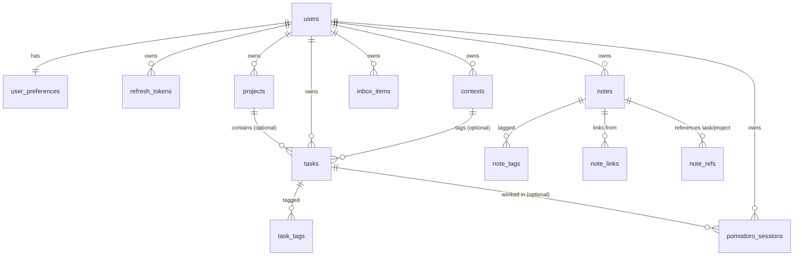

# DATA MODEL

## Diagramma ER (mermaid)

## Tabelle (campi salienti)

### users / user_preferences / refresh_tokens
- `users(id pk, email unique citext, password_hash, display_name, timestamps)`
- `user_preferences(user_id pk fk, pomodoro_duration_min, short_break_min, long_break_min, pomodoros_until_long_break, timezone)`
- `refresh_tokens(jti pk uuid, user_id fk, expires_at, revoked_at, created_at)`

### GTD
- `contexts(id pk, user_id fk, name, unique(user_id,name))` — es. `@casa`, `@ufficio`
- `projects(id pk, user_id fk, title, description, status[active|someday|completed], timestamps, completed_at)`
- `inbox_items(id pk, user_id fk, raw_text, processed_at, created_at)` — capture veloce
- `tasks(id pk, user_id fk, project_id fk?, context_id fk?, title, notes, status[inbox|next_action|waiting|scheduled|done], energy[low|medium|high]?, estimated_minutes?, priority, due_date?, defer_date?, completed_at?, timestamps)`
- `task_tags(task_id fk, tag, pk(task_id,tag))`

### Pomodoro
- `pomodoro_sessions(id pk, user_id fk, task_id fk?, kind[focus|short_break|long_break], planned_duration_sec, actual_duration_sec, cycle_index, started_at, ended_at, status[completed|aborted], created_at)`
- **Stato in-flight in Redis**: `pomodoro:active:{user_id}` → JSON di `ActiveTimer` con TTL = durata residua + margine 5'.

### Second Brain
- `notes(id pk, user_id fk, title, content_md, para_category[project|area|resource|archive], search_tsv, timestamps)`
- `note_tags(note_id fk, tag, pk(note_id,tag))`
- `note_links(source_note_id fk, target_note_id fk, pk, check source<>target)` — la nota A "linka" la nota B; i **backlinks** di B sono i source delle righe con target=B.
- `note_refs(id pk, note_id fk, ref_type[task|project], ref_id, unique(note_id, ref_type, ref_id))` — collegamento nota↔entità GTD.

## Indici e prestazioni
- `tasks_user_status_idx(user_id, status)` per le viste "next actions", "waiting"…
- `tasks_user_due_idx(user_id, due_date)` filtrato dove `due_date IS NOT NULL` per la dashboard Today.
- `notes_search_idx` GIN su `search_tsv` per la full-text search.
- `pomodoro_user_started_idx(user_id, started_at DESC)` per le liste recenti.

## Full-text search note
`search_tsv` è mantenuto da un trigger su INSERT/UPDATE di `title` + `content_md`,
con `setweight('A', title) || setweight('B', content)`. La query usa
`plainto_tsquery('simple', $)` per essere agnostica dalla lingua dell'utente.

## Convenzioni
- Ogni tabella applicativa ha `user_id` con `ON DELETE CASCADE` → cancellare
  l'utente cancella tutto il suo perimetro.
- Tutti i timestamp sono `TIMESTAMPTZ`, default `now()`.
- Status e categorie sono `TEXT` con `CHECK` constraint, non enum nativi
  Postgres, per restare migrabili senza fatica.
